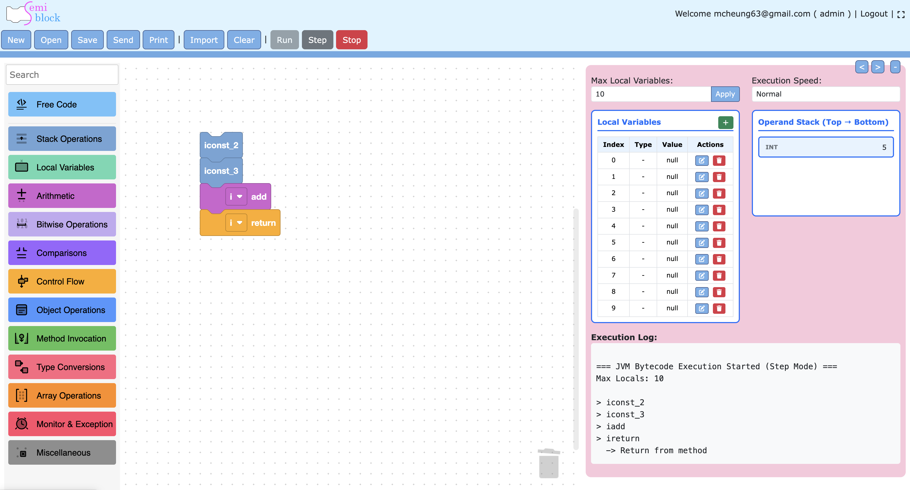

# Getting Started

This page walks you through opening the editor, creating your first bytecode sequence, and understanding the live generation loop.

## Opening the Editor

SemiBlock JVM lives inside the newblock-server application:

1. Log into the platform.
2. Navigate to the JVM / "Blockly JVM" section (the route that renders `resources/views/jvm.blade.php`).
3. The page loads the Blockly editor bundle (development: `http://localhost:8080/bundle.js`; production fallback: `/blockly-jvm/build-production/bundle.js`).

If the dev server is not running you will automatically get the last production build.

## The First Time You See It

- A large Blockly workspace on the left with a searchable toolbox.
- On the right: the **Generated Code** pane (beige background) showing highlighted, line-numbered bytecode, and an **Output** area below it.
- The toolbox starts with a **Free Code** category, followed by a labeled separator "JVM BYTECODE INSTRUCTIONS", then the 13 instruction categories.
- The workspace auto-loads anything previously stored under the `mainWorkspace` key in `localStorage`.

## Your First Bytecode Program

Goal: push two ints, add them, and return the result (equivalent to a static method returning `int`).

1. From **Stack Operations** → Constants, drag `iconst_2` and `iconst_3` into the workspace and stack them.
2. From **Arithmetic**, drag an `iadd` block and snap it under the constants.
3. From **Control Flow**, drag an `ireturn` (choose the `i` variant of `jvm_return`).
4. Watch the right-hand **Generated Code** pane update instantly:



5. Try the **smart push** block instead: drag `jvm_push`, set TYPE to `int` and VALUE to `2`. It emits `iconst_2`. Change the value to `300` and it switches to `sipush 300`.

## Using the Toolbox Search

Click in the search box at the very top of the toolbox and type `if` or `invoke`. The toolbox is filtered live to matching blocks and categories. Clear the box (or delete the text) to restore the full toolbox. The search box is re-injected after every filter because `updateToolbox` replaces the DOM subtree.

## Labels and Control Flow

Control flow blocks take label names as free text:

- Drag a `jvm_label` and name it `loop`.
- Use `jvm_goto` or `jvm_if_icmp` (with OP = `eq`, `lt`, etc.) targeting the same label string.
- The generator just emits the strings you typed; it does not verify that every goto has a matching label.

Example skeleton:

```
   jvm_label  name: start
   ... body ...
   jvm_if_icmp  op: lt  goto start
```

Emits:

```
   start:
   ...
   if_icmplt start
```

## Saving and Loading

- **Automatic**: Every non-UI change is saved to `localStorage` under `mainWorkspace` (see `save(ws)` + change listener).
- **Manual workspace JSON**: The host page and the exported `getWS()` / `loadWS(json)` let you copy a compact (base64-ish) representation of the workspace state.
- **Platform projects**: The blade template tracks `currentProjectId` / `currentProjectName` in localStorage and shows a "Save As" button when a project is active. This is handled outside the core blockly-jvm bundle.

Clear the workspace with the platform's clear button or by calling the exported `clearWorkspace()`.

## Running / "Executing"

Inside the editor bundle, `runCode()` only refreshes the syntax-highlighted view (highlight.js + line numbers). Actual interpretation or simulation of the bytecode (frame, locals, operand stack) is provided by additional scripts and UI in the host `jvm.blade.php` page (debugger panels, simulator, etc.).

## Tips

- Use **Free Code** blocks for anything not yet modeled (complex `ldc` string constants, `tableswitch`, `lookupswitch`, custom attributes, etc.).
- Stack and locals are your responsibility; the editor will happily let you generate unbalanced or type-incorrect bytecode.
- Descriptors matter: `invokevirtual java/lang/String.length()I`, `new java/lang/StringBuilder`, `getfield com/example/Foo.bar I`.
- The `jvm_push` block is the recommended way to introduce constants; the individual `iconst_*` / `bipush` / `ldc` blocks are still available when you want explicit control.

Next: see [Block Categories & Reference](blocks.md) for a tour of every category and the exact bytecode each block emits, and [Code Generation & Embedding](generation.md) for the generator implementation and public API surface.