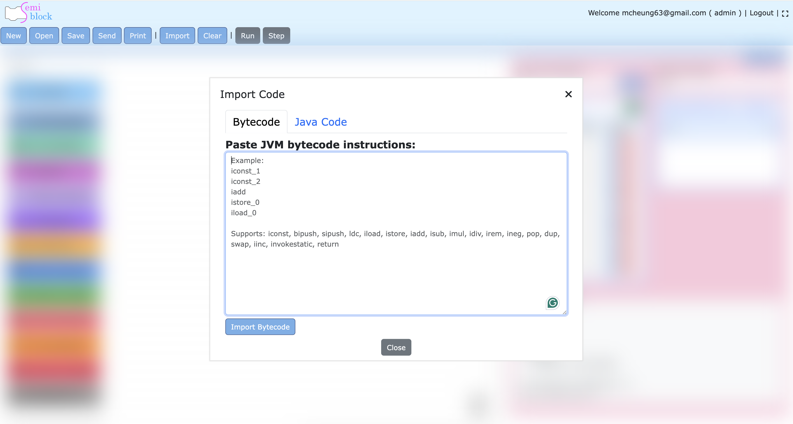
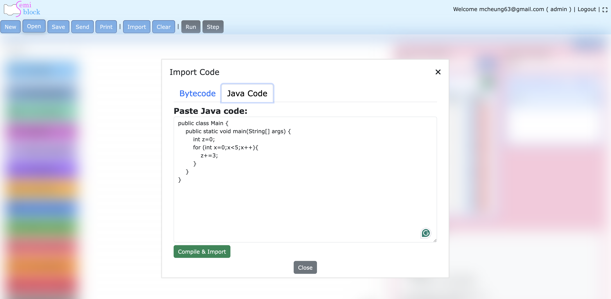

# Import

The **Import** feature lets you populate the visual Blockly workspace from existing code instead of dragging blocks manually.  
It supports **two distinct input paths**:

1. **Direct Bytecode** – paste raw JVM bytecode instructions (text form) and turn them into blocks.
2. **Java Code** – paste ordinary Java source; the server compiles it to bytecode and then imports the result as blocks.

Both paths ultimately create the same statement-oriented blocks that you would normally build by hand.

## Opening the Import Dialog

Click the **Import** button in the top toolbar (between "Clear" and "Run").

A modal dialog titled **Import Code** appears. It contains a tab strip with two tabs:

- **Bytecode**
- **Java Code**

You can switch freely between the tabs. The dialog also has a **Close** button at the bottom.

## 1. Direct Bytecode Import ("enter bytecodes")

Use this path when you already have textual JVM bytecode (for example, the output of `javap -c`, a hand-written instruction list, or the result of a previous export).

### Steps

1. Make sure the **Bytecode** tab is active.
2. Paste the instructions into the large textarea.
3. Click the blue **Import Bytecode** button.
 


### Input Format

The importer accepts several common forms:

- Plain instructions, one per line:
  ```
  iconst_1
  iconst_2
  iadd
  istore_0
  iload_0
  ireturn
  ```

- Line-numbered output produced by `javap -c` (the importer uses the numbers to place `jvm_label` blocks for jump targets):
  ```
  0: iconst_0
  1: istore_0
  2: iconst_0
  3: istore_1
  ...
  8: if_icmplt     2
  ```

- Comments (`// ...`) and directive lines (starting with `.` or `public class ...`) are automatically ignored.

### How Control Flow Is Handled

Before creating blocks the importer performs a first pass over the input to collect every jump target (the destination of any `if*`, `goto`, etc.).  
For every line number that is a target, it inserts a `jvm_label` block with that number as the label name.  
Subsequent `if*` / `goto` blocks are wired to those labels.

### Supported Instructions (current)

The placeholder text in the dialog lists the main families that are mapped today:

`iconst`, `bipush`, `sipush`, `ldc`, `iload`/`istore` (and other type variants), `iadd`/`isub`/`imul`/`idiv`/`irem`/`ineg`, `pop`/`dup`/`swap`, `iinc`, `invokestatic`, `return`, and the full set of `if*` / `goto` control-flow opcodes.

Unknown opcodes are skipped (a warning is printed to the browser console).

After a successful import the dialog closes and the generated blocks appear in the workspace. The right-hand **Generated Code** pane updates immediately.

## 2. Java Code → Compile → Blocks ("enter java and translate into blocks")

This path lets you write (or paste) normal Java source and have it automatically turned into visual blocks.

### Steps

1. Switch to the **Java Code** tab.
2. Paste or edit Java source in the textarea (a small example is pre-filled).
3. Click the green **Compile & Import** button.
4. Watch the status area below the button.



### What Happens Behind the Scenes

- The Java source is POSTed to `/project/compile-java`.
- On the server (`ProjectController::compileJava`):
  - A temporary directory is created.
  - The source is written to a `.java` file.
  - `javac` is executed.
  - If compilation succeeds, `javap -c -p` is run on the resulting `.class` file.
  - Only the `Code:` section of the method bodies is extracted (line-numbered bytecode).
- The extracted textual bytecode is placed into the Bytecode tab's textarea.
- `importBytecode()` is then called automatically, so the same block-creation logic used for direct import runs.
- Status messages are shown:
  - "Compiling Java code..."
  - "Compilation successful! Importing bytecode..."
  - On error: a red panel containing the compiler or disassembler output.

If anything fails (syntax error, missing `javac`, etc.) the process stops and you see the diagnostic output; the workspace is not modified.

### Example (pre-filled in the dialog)

```java
public class Main {
    public static void main(String[] args) {
        int z=0;
        for (int x=0;x<5;x++){
            z+=x;
        }
    }
}
```

This produces a loop with `if_icmplt` / `goto` and the corresponding `jvm_label` blocks after import.

## Notes and Limitations

- Both import paths create **statement blocks only** (they follow the same linear `previous`/`next` model as manual editing). There are no value sockets.
- The importer is best-effort: it maps the opcodes it knows about and silently skips the rest.
- Label names for control flow come from the line numbers present in `javap` output (or you can insert your own `jvm_label` blocks before importing).
- The Java compilation path requires a working JDK (`javac` + `javap`) on the machine that runs the newblock-server backend.
- Importing **replaces** the current workspace content; it does not merge with existing blocks.
- After import you can freely edit, add, or delete blocks. The live generator on the right-hand side will reflect your changes.
- Complex constant-pool entries, custom attributes, `tableswitch`/`lookupswitch`, invokedynamic, etc. may not round-trip perfectly.

## Related Topics

- [Getting Started](getting-started.md) – building blocks manually and using the toolbox.
- [Block Categories & Reference](blocks.md) – every block type and the exact bytecode it emits.
- [Code Generation & Embedding](generation.md) – how the generator and the public `quantr.*` API work.

The import UI and the two code paths are implemented in `resources/views/jvm.blade.php` (client-side `importBytecode` / `compileAndImportJava`) together with the backend route and `ProjectController::compileJava`.
